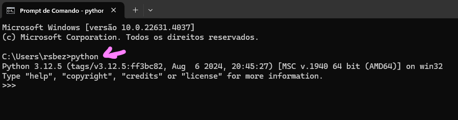

## Python

Python é uma linguagem interpretada onde não há nenhuma etapa de compilação necessária. Para executar aplicações Python, precisa de um interpretador de runtime (tempo de execuçao) para executar o código:

Modo interativo: cada comando digitado é interpretado e executado imediatamente, exemplo, o Idle.
Caso queira executar o interpretador no terminal, digite python + Enter para acessar e, para sair do interpretador, digite exit() 

*Alguns métodos para utilizar no interpretador*

dir() - vai mostrar o que tem no escopo local, como as importações do projeto;

dir(100) - quando coloca por exemplo 100 quer dizer que é um objeto do tipo inteiro (int), logo, vai retornar todos os métodos que é possível usar no objeto que está entre parênteses.

help() - vai mostrar o sistema de ajuda integrado; Para sair do help é só apertar Enter. Se você colocar help() nome_da_biblioteca, por exemplo, vai retornat tudo que a biblioteca faz;

help(objeto) - é só passar o objeto e vai retornar tudo sobre o objeto.

Para sair do help digite a tecla 'q'

python -i nome_arquivo.py - executa um script previamente feito no arquivo.py

Modo de script: no modo de script, você coloca um conjunto de instruções Python em um arquivo de texto com uma extensão .py .

Python é licenciado sob a licença de código aberto OSI.

Python é uma linguagem digitada dinamicamente, o que significa que o tipo de variável é determinado pelos dados atribuídos a ela.

## Variáveis e constantes em python

Em python não exite uma palavra reservada para indicar uma constante, então utiliza-se uma convenção entre os programadores: se estiver escrito com letras minúsculas se trata de variável, mas se estiver escrito com letras maiúsculas, então é para considerar uma constante, não podendo modificar o valor da atribuição.

Também é importante lembrar que o padrão de declaração para nomes compostos é o snake case, ou seja, substitua os espaços por underline para atender as boas práticas de programação python.

## Saídas

Por construtor: exemplo print(str(ID))

Por concatenação com formatação: exemplo texto = f'para {idade} o plano de saúde é {preco}' print(texto)

## Funções de entrada e saída

input()

print()

## Implementações

[Python](https://www.python.org/)
  
CPython é comumente usado para desenvolvimento web, desenvolvimento de aplicativos e scripts. Existem pacotes de instalação para Windows e macOS. 

[Anaconda](https://www.anaconda.com/)
  
Anaconda é uma distribuição Python especializada sob medida para tarefas de programação científica, como ciência de dados e aprendizado de máquina.

[Jupyter](https://jupyter.org/)
 
 Jupyter Notebook é um ambiente de programação interativo baseado na web que suporta várias linguagens de programação, incluindo Python. Os Jupyter Notebooks são amplamente utilizados em pesquisa e academia para modelagem matemática, aprendizado de máquina, análise estatística e para ensinar e aprender a codificar.

 ## REPL

 Basta digitar python no prompt de comando.

 

 ## Microsoft Learn

[Microsoft Learn](https://learn.microsoft.com/pt-pt/training/paths/python-language/?WT.mc_id=academic-105485-koreyst)

